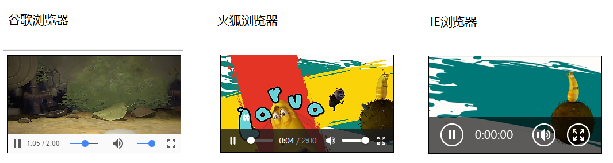

# video.js

# 1、h5多媒体标签--video

使用

`<video src="小猪佩奇.mp4" autoplay controls ></video>`

支持的格式

**video**常见属性、方法、事件

**source**标签

可以通过在多媒体标签内加入**source**标签，用来指定多个播放路径，当第一个**source**标签的路径出错时，自动会切换到第二个**source**标签

```html
<!-- 当1.mp4出错时，自动切换到2.mp4 ... -->
<video >
  <source src="1.mp4">
  <source src="2.mp4">
  <source src="3.mp4">
</video>
```

**object-fit属性**

当**video**标签视频内容宽度没有铺满video标签时，可以在css写上 该属性即可

```css
video {
  /* 让视频内容铺满整个video标签 */
  object-fit: fill;
}
```

## 1.1  兼容性

因为多媒体标签在不同的浏览器下是不一样的外观，我们有时候需要统一所有的样式，所以就需要我们自己使用**div + 多媒体 **的一些api实现 控制条工具  



## 1.2  公共属性

以下属性 是要直接写在标签上的 如 **autoplay** **controls**

`<video src="小猪佩奇.mp4" autoplay controls ></video>`

## 1.3  dom对象

以下属性，是提供给js的dom对象使用的，如，获取视频的长度**duration**

```js
var video=document.querySelector("video");
  
  // 获取视频长度
  var duration=video.duration;
```

## 1.4  dom对象的方法

## 1.5  dom对象的事件


# 2、video.js

Video.js是一款优秀的HTML5 Web视频播放器。它同时支持 HTM5 和 Flash 视频，支持在桌面和移动设备上的视频播放，截至目前，大概有40W的站点在使用Video.js作为web播放器。


## 2.1  官方网址

https://videojs.com/

[github](https://github.com/videojs/video.js)

## 2.2  使用步骤

### 2.2.1  引用文件

```html
<link rel="stylesheet" href="./lib/video.css">

<script src="/lib/video.js"></script>
```

### 2.2.2  初始化HTML结构

```js
<video id="my-video" class="video-js" controls preload="auto" width="640" height="264" poster="./img/timg (3).jpg" data-setup="{}">
  <source src="./video/蜡笔小新.mp4" type='video/mp4'>
    <p class="vjs-no-js">
      To view this video please enable JavaScript, and consider upgrading to a web browser that
        <a href="https://videojs.com/html5-video-support/" target="_blank">supports HTML5 			video</a>
	</p>
</video>
```

2.2.3  初始化

这一步不用也可以

```js
var myPlayer = videojs('my-player');
videojs("my-player").ready(function () {
  var myPlayer = this;
  myPlayer.play();
});
```

# 3、小项目

## 3.1  自定义播放器


### 3.1.1  运用到的知识点（4种class的方式）

1. `dom.classList.add('className')` **添加**
2. `dom.classList.remove('className')` **移除**
3. `dom.classList.toggle('className') `**切换**
4. `dom.classList.contains('className')` **判断**

```js
//暂停和播放按钮的切换
playBtn.classList.add("hide");
stopBtn.classList.remove("hide");
```

```js
//判断是否是当前视频
for (var j = 0; j < list.length; j++) {
  if (list[j].classList.contains("curr")) {
    list[j].classList.remove("curr");
  }
}
```

### 3.1.2  注册播放事件

```js
//1、为播放按钮注册点击事件
playBtn.onclick = function () {
  this.classList.add("hide");
  stopBtn.classList.remove("hide");
  console.log(video);
  //播放视频
  video.play();
}
```

### 3.1.3  注册暂停播放事件

```js
//2、为暂停按钮注册点击事件
stopBtn.onclick = function () {
  this.classList.add("hide");
  playBtn.classList.remove("hide");
  //暂停视频
  video.pause();
}
```

### 3.1.4  视频加载完毕，初始化进度条！！！！

```js
//视频加载完毕
video.oncanplay = function () {
  proRange.max = video.duration;
}
```

### 3.1.5  进度条随播放进度改变而改变

```js
//视频播放的每一分每一秒都对进度条进行该改变
//timeuplate(播放时-持续触发)
video.ontimeupdate = function () {
  //获取视频的当前播放进度 => 进度条按钮
  proRange.value = video.currentTime;
  //currentTime--当前播放进度
}
```

### 3.1.6  为进度条注册点击事件

```js
//3.1 为进度条注册点击事件
// oninput--当输入值的时候触发
// onchange--当鼠标弹起的时候才触发，无法实时
proRange.oninput = function () {
  video.currentTime = proRange.value;
}
```

### 3.1.7  点击显示音量图标

```js
//4、点击显示音量图标
//切换显示，音量按钮
voiceIcon.onclick = function () {
  //dom.classList.toggle('className') 切换
  controlVoice.classList.toggle("hide");
}
```

### 3.1.8  调整音量大小

```js
//绑定oninput事件
controlVoice.oninput = function () {
  //把按钮的值赋给视频的音量
  video.volume = this.value;
}
```

### 3.1.9  案例总结

1. 目的，熟悉一些视频的api和方法，属性

2. 讲解一个实现案例的思路，包含静态，动态……

3. 最终，达不到，实现的目的，因为一些标签和事件存在兼容性

4. 自定义鼠标事件 在模拟 oninput

       范围标签 => 不要使用 input:range  而是 自己使用div 封装进度条
       以上可以实现 但是 很繁琐

5.使用插件 video.js 可以达到最开始的目的

功能齐全，样式一致！

## 3.2  video.js简单项目


